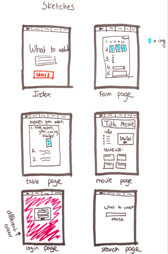
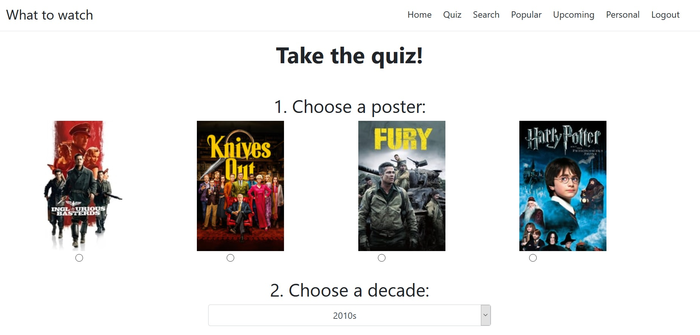
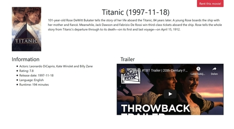
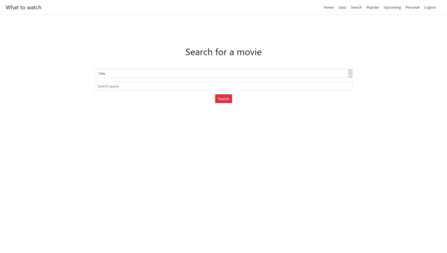
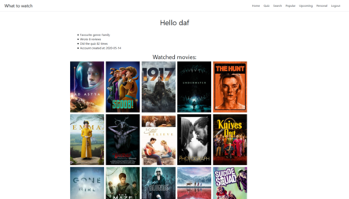
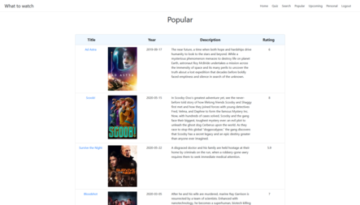
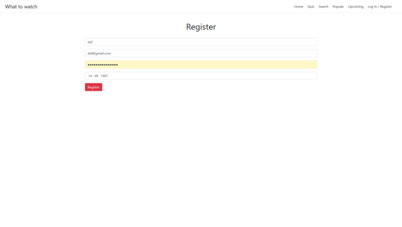
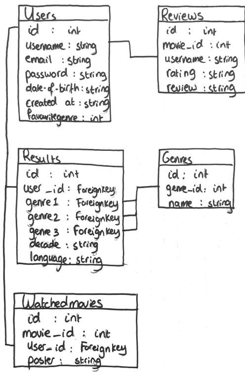

# What to watch by Daphne Westerdijk

I watch a lot of netflix but sometimes it is really hard to find a good movie to watch. This application will give you a list of movies based on your interests/personality. You can then go over the list and see if there is one that sparks your interest. When you click on the movie, you can also watch a trailer to see if it really something you want to watch.

## The problem

Sometimes you want to watch a movie/tv show but you don't know what to watch. Then it would be very handy to get a customize selection of movies based on your interests. 

## The solution

When you open this web application, you will fill out a quick form. After you submit, a table with movies will come up that are related to your interests (based on genres) and have a high rating. When clicking on the movie, you will get more details and a trailer.

## Sketches

# The final product
## What is in the files

* Application.py contains the functionality of the what to watch website including all the links to the different pages.
    1. Quiz, where the questions are dynamic through a randomized genre picker and then getting the posters from the movie database API (random from a 20 item movie list). This means that everytime the user does the quiz, it looks different and therefore can spark interest into a genre that you might normally wouldn't choose.

    

    2. Results, showcases the movies based on the answers of the quiz and uploads the criteria to the database. Watched movies are removed from the results so that the user only gets the results of movies that he/she hasn't watched.

    3. Movie page, contains details recovered from the API (year, runtime, trailer, reviews etc.). The user can also review and rate the movie on the page. This is the page where the user will decide if this is a movie they want to watch and there is also a button where they can "rent" the movie.

    

    4. Already watched movies, button on the movie pages which adds the movie_id and poster path to the database.

    5. Submit, submits the review written by the user on the movie page.

    6. Search/searchresults, the user can search for a movie based on title or year. With this information, a movie list is recovered from the API.

    

    7. Personal page, showcases the personal information of the user: favourite genre is based on previous results of the quiz, how many reviews are written by the user, how many times they did the quiz and when the account was created. It also showcases a grid of movies that the user has watched, which makes it more colourful.

    

    8. Upcoming/Popular, these pages showcase the upcoming and popular movies with links to their movie page. The information is gathered from the API. 

    

    9. Login/signup/logout, create and use of the account of a user. It is implemented with the use of sessions.

    

    10. Mollie/rent, on the movie page there is a button where you can rent a movie. The user is redirected to a payment by mollie and when paid, gets to see the movie (is actually just a bigger version of the trailer)

* The templates folder contains the html pages of the webapp. These are just a visual representation of the functionality described above.

* Static/styles contains the styling of the website as well as the javascript file.

* Models.sql contains the data to create the tables in the database. 

* PROCESS.md is a workbook with the process of making the webapp. There is a small entry everyday to see how the design has changed / what I did on that day.

* Design.md file contains all my plans for the webapp before I started coding. It stayed mostly the same during the process.

## Updated database

